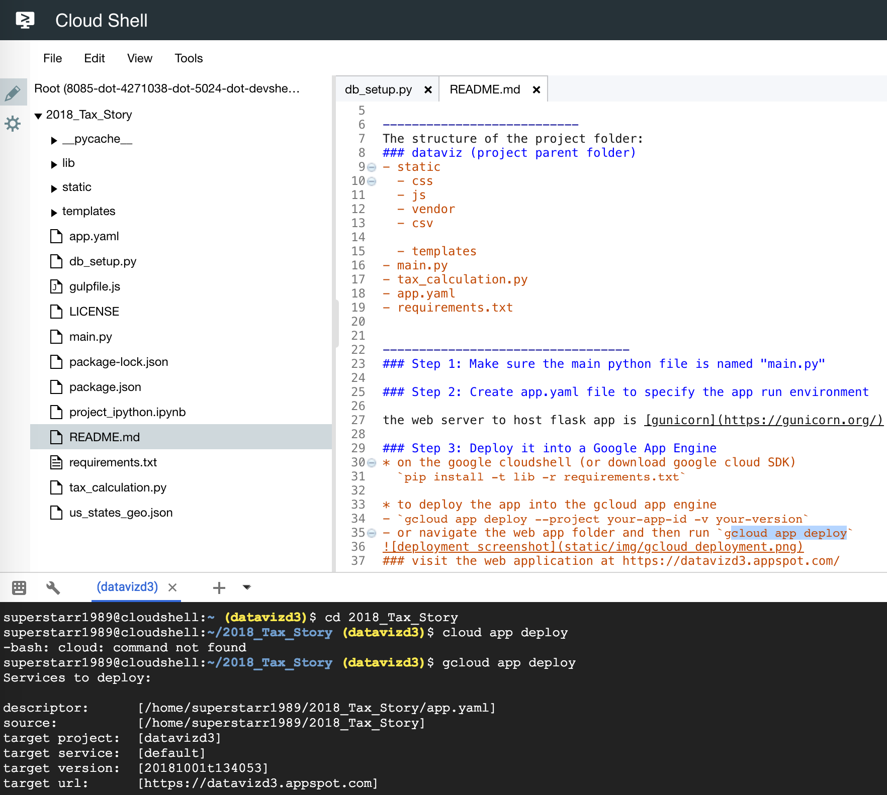

# 2018_Tax_Story
A team of 4 investigates how the new 2018 tax rate would impact American households. Based on Federal tax rate, state states.

This is based on the flask app

---------------------------
The structure of the project folder:
### dataviz (project parent folder)
- static
  - css
  - js
  - vendor
  - csv

  - templates
- main.py
- tax_calculation.py
- app.yaml
- requirements.txt

----------------------------------
### Step 1: Make sure the main python file is named "main.py"

### Step 2: Create app.yaml file to specify the app run environment

the web server to host flask app is [gunicorn](https://gunicorn.org/) in a production environemnt. Gunicorn is a Python WSGI HTTP Server.

### Step 3: Deploy it into a Google App Engine
* on the google cloudshell (or download google cloud SDK)
  `pip install -t lib -r requirements.txt`

* to deploy the app into the gcloud app engine
- `gcloud app deploy --project your-app-id -v your-version`
- or navigate the web app folder and then run `gcloud app deploy`

### visit the web application at https://datavizd3.appspot.com/